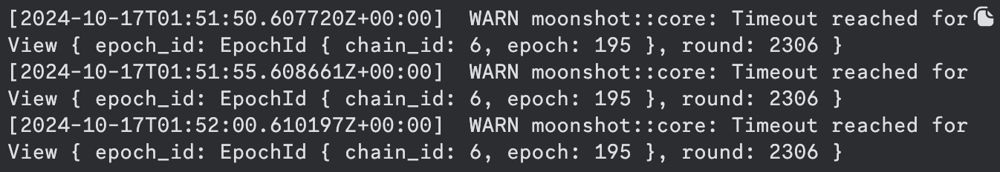
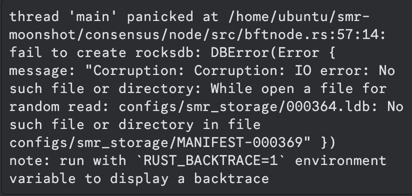
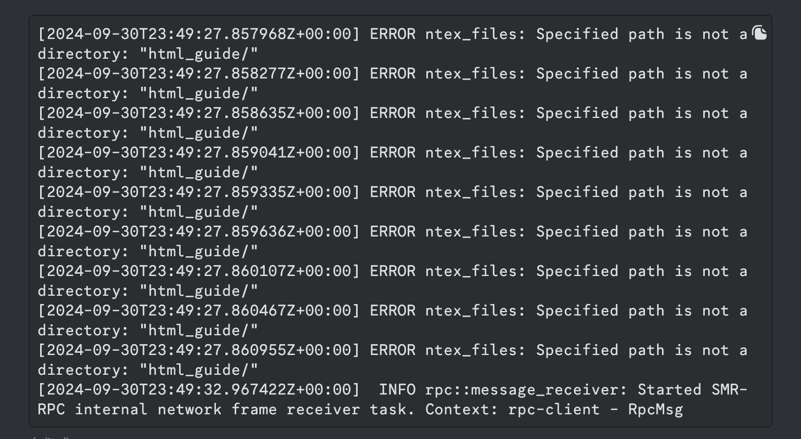

# NodeOps-Support-FAQ

This document is created to support node operators, with their issue, and solutions they can administer before reaching out for support.

## FAQ
#### 1. Should the onboarding script be run directly on the machine that will act as the staking provider?

__Answer__:
You should run all the steps of Round onboarding for Public Testnet on the machine that will act as a stacking provider.

#### 2. What are the hardware requirements?

__Answer__:

Below are the hardware requirements: 
- Cores: 16 to 32
- RAM: 64G
- CPU: Intel(R) Xeon(R) Platinum CPU @ 2.8GHz speed or higher
- Architecture: x86/64
- Disk Type: SSD
- Minimum Disk Size: 2TB
- Network Bandwidth: 1Gbps

  
Blocks are frozen

    
    <h4>Description</h4>
    
Epoch and round are stuck in a particular number

    <h4>Solution</h4>

  
Corruption: IO error

  
  <h4>Description</h4>
    
Database thread 'main' panicked

    <h4>Solution</h4>
    1. <code>docker ps -a</code> 
    2. <code>docker stop supra_${ip_address}</code> 
    3. <code>sudo rm -rf ./supra_configs/ledger_storage ./supra_configs/smr_storage/* ./supra_configs/supra_node_logs </code> 
    4. <code>./supra_configs/latest_snapshot.zip ././supra_configs/snapshot </code> 
    5.<code> wget -O ./supra_configs/latest_snapshot.zip https://testnet-snapshot.supra.com/snapshots/latest_snapshot.zip </code> 
    6. <code>unzip ./supra_configs/latest_snapshot.zip -d ./supra_configs/ </code> 
    7. <code>cp ./supra_configs/snapshot/snapshot_*/* ./supra_configs/smr_storage/ </code> 
    8. <code>docker start supra_${ip_address} </code> 
    9. <code>docker exec -it supra_$ip_address /supra/supra node smr run </code>

  
RPC Error on startup

    
    <h4>Description</h4>
    
rpc::client: Failed to reconnect to server, will try again in 5 seconds

    <h4>Solution</h4>
    <strong>Note:</strong> Open port 26000 and 27000 
    <strong>Step 1:</strong> 
     <code>sudo rm -rf ./supra_configs/rpc_archive ./supra_configs/rpc_ledger ./supra_configs/snapshot ./supra_configs/rpc_store/* ./supra_configs/rpc_node_logs ./supra_configs/latest_snapshot.zip</code> 
    <strong>Step 2:</strong> 
    <code>wget -O ./supra_configs/latest_snapshot.zip https://testnet-snapshot.supra.com/snapshots/latest_snapshot.zip</code> 
    <strong>Step 3:</strong> 
    <code>unzip ./supra_configs/latest_snapshot.zip -d ./supra_configs/</code> 
    <strong>Step 4: </strong> 
    <code>cp -r ./supra_configs/snapshot/snapshot_*/* ./supra_configs/rpc_store/</code> 
    <strong>Step 5:</strong> 
    <code>docker exec -itd supra_rpc_{your_rpc_ip} /supra/rpc_node </code>

  
RPC logs | ERROR ntex_files

    
    <h4>Description</h4>
    
ERROR ntex_files: Specified path is not a directory: "html_guide/"

    <h4>Solution</h4>

  
RPC Node Phase 2 Error

    
    <h4>Description</h4>
    
kind: UnexpectedEof, error: Error("EOF while parsing a value", line: 1, column: 0)

    <h4>Solution</h4>
    <pre>docker stop ${Container_name}
    docker remove ${Container_name}</pre>
    then repeat Step 1~3

  
Grafana not populating data to graphs

    
    
    <h4>Description</h4>
    
Dashboard is not populating correctly

    <h4>Solution</h4>
    Add the full log path with the file name inside the <pre>/etc/promtail/config.yml</pre>
and restart the promtail.service
    It should look like the below
    <code>__path__: "/home/node/supra_configs_mainnet/supra_node_logs/supra.log"</code>

